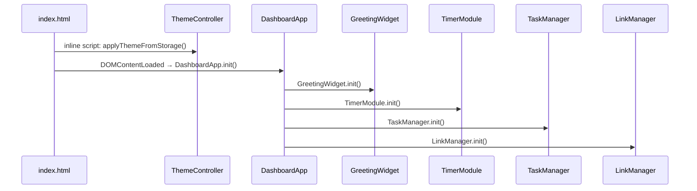

# Design Document: New Tab Dashboard

## Overview

The New Tab Dashboard is a zero-dependency, single-page application (SPA) delivered as a single HTML file with one external CSS file and one external JavaScript file. It runs entirely in the browser with no build step, no framework, and no backend. All state is held in memory during the session and persisted to `localStorage` on every mutation.

The application is composed of five logical widgets rendered inside a single `index.html`:

| Widget | Responsibility |
|--------|---------------|
| Greeting_Widget | Live clock, date, time-based greeting, custom name |
| Timer | Pomodoro countdown with configurable duration |
| Task_Manager | To-do CRUD with duplicate prevention and sorting |
| Link_Manager | Quick-link CRUD |
| Theme_Controller | Light/dark mode toggle |

### Design Goals

- **Instant load**: Theme applied before first paint (inline `<script>` in `<head>`) to prevent flash of wrong theme.
- **Single responsibility**: Each widget owns its DOM subtree, its localStorage key(s), and its event listeners.
- **Fail-safe persistence**: All localStorage writes wrapped in try/catch; the app degrades to in-memory only mode with a visible banner.
- **No global state soup**: Each module exposes an `init()` function; shared state is passed explicitly.

---

## Architecture

### File Structure

```
index.html          ← single HTML entry point
css/
  style.css         ← all styles (light theme vars + dark theme overrides)
js/
  app.js            ← all JavaScript (module pattern via IIFEs / ES6 modules)
```

### Module Organization Within `app.js`

Because the constraint is a single JS file, modules are organized as named object literals (namespace pattern) and wired together at the bottom of the file via a `DashboardApp.init()` call.

```
app.js
├── StorageService        — safe localStorage wrapper
├── ThemeController       — theme read/write/toggle
├── GreetingWidget        — clock, date, greeting, name
├── TimerModule           — Pomodoro state machine
├── TaskManager           — task CRUD, duplicate detection, sorting
├── LinkManager           — quick-link CRUD, URL validation
└── DashboardApp          — orchestrator: calls init() on each module
```

### Initialization Sequence



The inline `<script>` tag in `<head>` reads the theme key from localStorage and applies a CSS class to `<html>` before any paint — this is the only code outside `app.js` and it is intentionally minimal to prevent a flash of the wrong theme (Requirement 13.3).

---

## Components and Interfaces

### StorageService

Wraps every `localStorage` call. If `localStorage` throws (private browsing, quota exceeded, security error), `StorageService` sets an internal `available` flag to `false` and emits a one-time warning banner.

```
StorageService
  .get(key)              → any | null
  .set(key, value)       → void
  .remove(key)           → void
  .isAvailable()         → boolean
```

### ThemeController

```
ThemeController
  .init()                → reads theme from storage, applies to <html>
  .toggle()              → flips current theme, saves, re-applies
  .getCurrent()          → "light" | "dark"
```

CSS implementation: a `data-theme="dark"` attribute on `<html>` activates a set of CSS custom property overrides. No class toggling needed.

### GreetingWidget

```
GreetingWidget
  .init()                → starts clock interval, renders name, greeting
  .setName(name)         → validates, saves to storage, updates greeting
  ._tick()               → internal: updates clock DOM every 1000ms
  ._getGreeting(hour)    → pure: number → string
  ._buildMessage(g, n)   → pure: (string, string|null) → string
  ._formatTime(h,m,s)    → pure: (number,number,number) → "HH:MM:SS"
  ._formatDate(date)     → pure: Date → "Weekday, DD Month YYYY"
```

### TimerModule

The timer is modeled as a simple state machine:

```
States: STOPPED | RUNNING | FINISHED
Transitions:
  STOPPED  --start-->  RUNNING
  RUNNING  --stop-->   STOPPED
  RUNNING  --tick(0)--> FINISHED
  FINISHED --reset-->  STOPPED
  STOPPED  --reset-->  STOPPED
  RUNNING  --reset-->  STOPPED
```

```
TimerModule
  .init()               → loads duration from storage, renders, wires buttons
  .start()              → STOPPED→RUNNING, begins setInterval(1000)
  .stop()               → RUNNING→STOPPED, clears interval
  .reset()              → any→STOPPED, restores full duration
  .setDuration(minutes) → validates [1,120], saves, resets display
  ._tick()              → decrements remaining, checks for FINISHED
  ._render()            → formats MM:SS, updates DOM, syncs button states
  ._formatTimer(secs)   → pure: number → "MM:SS"
```

Button state rule: `startBtn.disabled = (state === RUNNING)`, `stopBtn.disabled = (state !== RUNNING)`.

### TaskManager

```
TaskManager
  .init()               → loads tasks from storage, renders in current sort mode
  .addTask(text)        → validates, deduplicates, creates Task, saves, renders
  .editTask(id, text)   → validates, deduplicates, updates Task, saves, renders
  .deleteTask(id)       → removes Task from array, saves, renders
  .toggleComplete(id)   → flips done flag, saves, renders
  .setSortMode(mode)    → saves mode, re-renders (no data mutation)
  ._normalize(text)     → pure: string → trimmed lowercase
  ._isDuplicate(text, excludeId?) → pure: checks against incomplete tasks
  ._sortTasks(tasks, mode) → pure: Task[] → Task[] (new sorted array)
  ._renderList()        → builds DOM from sorted task array
```

### LinkManager

```
LinkManager
  .init()               → loads links from storage, renders
  .addLink(label, url)  → validates both fields, saves, renders
  .deleteLink(id)       → removes from array, saves, renders
  ._validateURL(url)    → pure: string → boolean (http/https scheme + host)
  ._renderLinks()       → builds DOM from link array
```

---

## Data Models

All data is stored in `localStorage` as JSON strings. The keys are fixed constants defined at the top of `app.js`.

### localStorage Keys

| Constant | Key String | Data Type | Default |
|----------|-----------|-----------|---------|
| `KEY_THEME` | `"ndt_theme"` | `"light" \| "dark"` | `"light"` |
| `KEY_USER_NAME` | `"ndt_user_name"` | `string \| null` | `null` |
| `KEY_POMODORO_DURATION` | `"ndt_pomodoro_duration"` | `number` (integer, 1–120) | `25` |
| `KEY_TASKS` | `"ndt_tasks"` | `Task[]` | `[]` |
| `KEY_SORT_MODE` | `"ndt_sort_mode"` | `"default" \| "az" \| "za" \| "completed_last"` | `"default"` |
| `KEY_LINKS` | `"ndt_links"` | `QuickLink[]` | `[]` |

All keys are prefixed with `ndt_` (New Tab Dashboard) to avoid collisions with other apps using the same browser storage.

### Task Schema

```json
{
  "id": "string (UUID or timestamp-based unique ID)",
  "text": "string (1–200 chars, stored as-entered with trimming applied)",
  "done": "boolean",
  "createdAt": "number (Unix timestamp ms, from Date.now())"
}
```

### QuickLink Schema

```json
{
  "id": "string (UUID or timestamp-based unique ID)",
  "label": "string (1–50 chars)",
  "url": "string (1–2048 chars, http/https validated)"
}
```

### Malformed Data Handling

On load, every `StorageService.get()` call is followed by a schema check. If parsed data fails the check (wrong type, missing required fields, out-of-range values), the module discards the corrupted value and falls back to the default. This satisfies Requirement 14.3 without crashing.

---

## UI/UX Design Decisions

### Layout

The dashboard uses a CSS Grid layout. On desktop (≥768px), widgets are arranged in a two-column grid. On mobile (<768px), the grid collapses to a single column. The minimum supported width is 320px with no horizontal scrolling.

```
┌─────────────────────────────────────┐
│  [Theme Toggle]          (top-right)│
│                                     │
│  ┌───────────────────────────────┐  │
│  │  Greeting Widget (full width) │  │
│  │  Clock | Date | Greeting+Name │  │
│  └───────────────────────────────┘  │
│                                     │
│  ┌───────────┐  ┌────────────────┐  │
│  │  Timer    │  │  Task Manager  │  │
│  │  MM:SS    │  │  [ ] Task 1    │  │
│  │  ─────    │  │  [ ] Task 2    │  │
│  │  Duration │  │  Sort: [▾]     │  │
│  └───────────┘  └────────────────┘  │
│                                     │
│  ┌───────────────────────────────┐  │
│  │  Link Manager (full width)    │  │
│  │  [Link1] [Link2] [Link3]...   │  │
│  └───────────────────────────────┘  │
└─────────────────────────────────────┘
```

### Theme System

The CSS uses custom properties (variables) declared on `:root` for the light theme and overridden in `[data-theme="dark"]` on `<html>`. This means a single attribute change on the root element repaints the entire page with no JavaScript style manipulation beyond setting `document.documentElement.dataset.theme`.

```css
:root {
  --color-bg: #ffffff;
  --color-surface: #f5f5f5;
  --color-text: #1a1a1a;
  /* ... */
}

[data-theme="dark"] {
  --color-bg: #121212;
  --color-surface: #1e1e1e;
  --color-text: #e0e0e0;
  /* ... */
}
```

To prevent flash-of-wrong-theme (FOUT), the following inline script is placed in `<head>` before the CSS link tag:

```html
<script>
  (function() {
    var t = localStorage.getItem('ndt_theme');
    if (t === 'dark') document.documentElement.dataset.theme = 'dark';
  })();
</script>
```

This runs synchronously before any render, so the first paint always uses the correct theme.

### Responsive Behavior

| Breakpoint | Layout |
|-----------|--------|
| < 768px | Single column, full-width cards |
| 768px – 1199px | Two-column grid, Timer left / Task Manager right |
| ≥ 1200px | Two-column grid with max-width container centered |

All interactive controls (buttons, inputs) have a minimum touch target of 44×44px for mobile usability.

### Accessibility

- All form inputs have associated `<label>` elements.
- Timer buttons use `aria-label` to describe current action.
- Theme toggle uses `aria-pressed` to reflect current state.
- Task completion checkboxes are native `<input type="checkbox">` elements.
- Color contrast ratios meet WCAG 2.1 AA in both themes.

---

## Key Algorithms

### Time-Based Greeting (`_getGreeting(hour)`)

```
hour ∈ [5, 11]  → "Good Morning"
hour ∈ [12, 17] → "Good Afternoon"
hour ∈ [18, 21] → "Good Evening"
hour ∈ [22, 23] ∪ [0, 4] → "Good Night"
```

The function takes an integer hour (0–23) and returns the greeting string. It is a pure function with no side effects, making it directly testable.

### Duplicate Task Detection (`_isDuplicate(text, excludeId)`)

```
normalize(text) = text.trim().toLowerCase()

isDuplicate(newText, excludeId):
  normalized = normalize(newText)
  for each task T in tasks where T.id ≠ excludeId AND T.done === false:
    if normalize(T.text) === normalized: return true
  return false
```

The `excludeId` parameter is used during edits so a task is not flagged as a duplicate of itself. Only **incomplete** tasks are checked — completed tasks do not block adding a new task with the same text.

### Task Sort Logic (`_sortTasks(tasks, mode)`)

The sort does **not** mutate the stored tasks array; it operates on a shallow copy returned for rendering only.

| Mode | Comparator |
|------|-----------|
| `"default"` | `a.createdAt - b.createdAt` (ascending) |
| `"az"` | `a.text.localeCompare(b.text)` |
| `"za"` | `b.text.localeCompare(a.text)` |
| `"completed_last"` | `a.done - b.done`, tie-break by `a.createdAt - b.createdAt` |

`Array.prototype.sort()` is used. ECMAScript requires stable sort (as of ES2019), so tie-breaking by `createdAt` is consistent across all browsers in the compatibility matrix.

### Timer Countdown Mechanism

The timer uses `setInterval(tick, 1000)` for the countdown. `setInterval` is not perfectly precise, so the implementation records the `startTime = Date.now()` and `startRemaining` when the timer starts, and on each tick computes:

```
elapsed = Math.floor((Date.now() - startTime) / 1000)
remaining = startRemaining - elapsed
```

This prevents drift accumulation. If `remaining ≤ 0`, the timer transitions to `FINISHED`.

### URL Validation (`_validateURL(url)`)

```
try {
  const parsed = new URL(url.trim());
  return parsed.protocol === 'http:' || parsed.protocol === 'https:';
} catch {
  return false;
}
```

Using the built-in `URL` constructor ensures proper scheme + host validation without a regex. An empty string, a bare hostname without scheme, or an `ftp://` URL all return `false`.

### Unique ID Generation

Task and link IDs are generated as:

```js
id = `${Date.now()}-${Math.random().toString(36).slice(2, 9)}`
```

This combines a millisecond timestamp with a random base-36 suffix. Collision probability is negligible for single-user local use.

---

# Correctness Properties

*A property is a characteristic or behavior that should hold true across all valid executions of a system — essentially, a formal statement about what the system should do. Properties serve as the bridge between human-readable specifications and machine-verifiable correctness guarantees.*

## Property Reflection

Before writing the final properties, redundant candidates are eliminated:

- **2.1–2.4** (greeting by hour range) can be unified: *for any hour in [0,23], `getGreeting(hour)` returns the correct greeting*. No need for four separate properties — one covers all ranges.
- **2.5 and 2.6** (greeting with/without name) can be unified: `buildMessage(greeting, name)` behavior for both null and non-null name.
- **8.2 and 8.3** (toggle completion both directions) unify into a round-trip property.
- **6.4 and 7.5** (duplicate detection for add and edit) share the same `_isDuplicate` logic — covered by one property with the `excludeId` variation handled by testing both paths.
- **5.2 and 5.3** (valid and invalid duration) each verify distinct behavior (accept vs. reject) and are kept separate.
- **9.2 and 12.2** (task delete / link delete) are structurally identical but test different modules, so each is kept as its own property.

After reflection, 14 properties are retained from the original candidate set.

---

### Property 1: Time formatting is always zero-padded HH:MM:SS

*For any* integer hour in [0,23], minute in [0,59], and second in [0,59], `formatTime(h, m, s)` SHALL return a string of exactly the form `"HH:MM:SS"` where each component is zero-padded to two digits.

**Validates: Requirements 1.1**

---

### Property 2: Date formatting contains all required components

*For any* valid `Date` object, `formatDate(date)` SHALL return a string that contains the full weekday name, the day number, the full month name, and the four-digit year of that date.

**Validates: Requirements 1.2**

---

### Property 3: Greeting selection covers all 24 hours

*For any* integer hour in [0, 23], `getGreeting(hour)` SHALL return exactly one of "Good Morning", "Good Afternoon", "Good Evening", or "Good Night", with the correct greeting for each hour range (Morning: 5–11, Afternoon: 12–17, Evening: 18–21, Night: 22–23 and 0–4).

**Validates: Requirements 2.1, 2.2, 2.3, 2.4**

---

### Property 4: Greeting message includes name when present, omits it when absent

*For any* greeting string `g` and any name string `n`, `buildGreetingMessage(g, n)` SHALL return `g + ", " + n` when `n` is non-empty after trimming, and SHALL return exactly `g` when `n` is null, undefined, or whitespace-only.

**Validates: Requirements 2.5, 2.6**

---

### Property 5: Name persistence round-trip

*For any* non-empty string `name` (after trimming), calling `saveName(name)` SHALL result in `localStorage.getItem(KEY_USER_NAME)` returning the trimmed `name` value.

**Validates: Requirements 3.2**

---

### Property 6: Whitespace-only name clears storage

*For any* string composed entirely of whitespace characters (spaces, tabs, newlines), calling `saveName(input)` SHALL result in `localStorage.getItem(KEY_USER_NAME)` returning `null`.

**Validates: Requirements 3.3**

---

### Property 7: Timer formatting is always zero-padded MM:SS

*For any* integer `seconds` in [0, 99×60 + 59], `formatTimer(seconds)` SHALL return a string of exactly the form `"MM:SS"` where MM is the whole minutes (zero-padded, 0–99) and SS is the remaining seconds (zero-padded, 0–59).

**Validates: Requirements 4.1**

---

### Property 8: Timer countdown is monotonically decreasing by one per tick

*For any* starting remaining-seconds value `T > 0` and any `N` ticks where `N ≤ T`, after `N` internal tick calls the timer's remaining value SHALL equal `T − N`.

**Validates: Requirements 4.3**

---

### Property 9: Timer resets to configured duration

*For any* configured Pomodoro duration `D` (minutes in [1,120]), after calling `reset()`, the timer's displayed remaining time SHALL equal `D` minutes in `MM:SS` format, regardless of what the remaining time was before the reset.

**Validates: Requirements 4.5**

---

### Property 10: Timer button states match running status

*For any* timer state (RUNNING or STOPPED/FINISHED), the Start button's `disabled` property SHALL equal `(state === RUNNING)` and the Stop button's `disabled` property SHALL equal `(state !== RUNNING)`.

**Validates: Requirements 4.7, 4.8**

---

### Property 11: Valid Pomodoro duration is persisted and reflected in timer display

*For any* integer `d` in [1, 120], calling `setDuration(d)` SHALL store `d` in localStorage under `KEY_POMODORO_DURATION` AND reset the timer display to show `d` minutes.

**Validates: Requirements 5.2**

---

### Property 12: Out-of-range Pomodoro duration is rejected

*For any* integer `d` outside [1, 120] (i.e., `d < 1` or `d > 120`), calling `setDuration(d)` SHALL leave localStorage unchanged and SHALL not update the timer display.

**Validates: Requirements 5.3**

---

### Property 13: Adding a valid task creates it with correct fields

*For any* non-empty, non-duplicate task text string `t` (after trimming), calling `addTask(t)` SHALL add exactly one new Task to the list where the task's `text` equals `t.trim()`, the `id` is a non-empty unique string, and `createdAt` is a positive integer.

**Validates: Requirements 6.2**

---

### Property 14: Whitespace-only task text is rejected

*For any* string composed entirely of whitespace characters, calling `addTask(input)` SHALL leave the task list length unchanged and SHALL not write to localStorage.

**Validates: Requirements 6.3**

---

### Property 15: Duplicate task detection (case-insensitive, trimmed)

*For any* existing incomplete Task with text `T`, attempting to add any string `s` where `s.trim().toLowerCase() === T.text.trim().toLowerCase()` SHALL be rejected — the task list length SHALL remain unchanged.

**Validates: Requirements 6.4, 7.5**

---

### Property 16: Task edit round-trip

*For any* Task id `id` and valid (non-empty, non-duplicate) new text `newText`, calling `editTask(id, newText)` SHALL result in the task with that id having `text === newText.trim()` in both the in-memory list and in localStorage.

**Validates: Requirements 7.3**

---

### Property 17: Whitespace-only edit is rejected and leaves original text unchanged

*For any* Task id `id` and any whitespace-only string `s`, calling `editTask(id, s)` SHALL leave the task's text unchanged in both the in-memory list and localStorage.

**Validates: Requirements 7.4**

---

### Property 18: Completion toggle is a round-trip (involution)

*For any* Task, toggling its completion status twice (done → undone, or undone → done → undone) SHALL return the task to its original `done` value, and the localStorage representation SHALL match after each toggle.

**Validates: Requirements 8.2, 8.3**

---

### Property 19: Deleting a task removes only that task

*For any* task list containing Task `T` and at least one other task, calling `deleteTask(T.id)` SHALL result in a list that does not contain `T` but contains all other tasks unchanged, and localStorage SHALL reflect the same.

**Validates: Requirements 9.2**

---

### Property 20: Sort does not mutate stored task data

*For any* task list and *any* sort mode, calling `setSortMode(mode)` SHALL not change the `text`, `done`, `id`, or `createdAt` fields of any task in localStorage — only the rendered display order changes.

**Validates: Requirements 10.2**

---

### Property 21: Sort order is correct for all modes

*For any* task list and each sort mode (`"default"`, `"az"`, `"za"`, `"completed_last"`), `sortTasks(tasks, mode)` SHALL return a list where every adjacent pair `(a, b)` satisfies the mode's comparator (creation-time ascending, A–Z, Z–A, or completed tasks after incomplete tasks).

**Validates: Requirements 10.2**

---

### Property 22: Valid quick-link is persisted and rendered

*For any* label string `l` (1–50 chars) and URL string `u` with a valid `http://` or `https://` scheme and host, calling `addLink(l, u)` SHALL add a QuickLink to the list with those values and save it to localStorage.

**Validates: Requirements 11.2**

---

### Property 23: Invalid quick-link input is rejected

*For any* input where the label is empty/whitespace-only OR the URL lacks a valid `http`/`https` scheme and host (including empty strings, bare hostnames, and non-http schemes), calling `addLink(label, url)` SHALL leave the link list unchanged and SHALL not write to localStorage.

**Validates: Requirements 11.3**

---

### Property 24: Deleting a link removes only that link

*For any* link list containing QuickLink `L` and at least one other link, calling `deleteLink(L.id)` SHALL result in a list that does not contain `L` but contains all other links unchanged, and localStorage SHALL reflect the same.

**Validates: Requirements 12.2**

---

### Property 25: Theme toggle is a round-trip (involution)

*For any* current theme `T` (either `"light"` or `"dark"`), calling `toggleTheme()` twice SHALL restore the theme to `T` in both the DOM (`document.documentElement.dataset.theme`) and localStorage.

**Validates: Requirements 13.2**

---

## Error Handling

### localStorage Unavailability

`StorageService` wraps every read and write in a try/catch. On the first caught error:

1. Sets `available = false` internally.
2. Renders a non-blocking banner: *"Warning: Local Storage is unavailable. Your data will not be saved in this session."*
3. All subsequent `.set()` and `.remove()` calls are no-ops.
4. All `.get()` calls return `null`, causing each module to fall back to its default value.

The banner is dismissible but reappears if the user reloads (since storage remains unavailable).

### Malformed / Unparseable Data

On load, every value read from localStorage goes through a validation function before use:

| Data | Validation |
|------|-----------|
| Tasks | Must be an array; each item must have `id` (string), `text` (string), `done` (boolean), `createdAt` (number). Invalid items are filtered out. |
| Links | Must be an array; each item must have `id`, `label`, `url` (all strings). Invalid items are filtered out. |
| Pomodoro duration | Must be an integer in [1, 120]. Falls back to 25. |
| Sort mode | Must be one of the four valid mode strings. Falls back to `"default"`. |
| Theme | Must be `"light"` or `"dark"`. Falls back to `"light"`. |
| User name | Must be a string. Falls back to `null`. |

Corrupted data is silently discarded (not re-saved to storage) so a user who clears and re-enters data will write fresh valid data.

### Timer Edge Cases

- If the tab is hidden (visibilitychange event), the `setInterval` may fire less frequently. The drift-correction algorithm (using `Date.now()` delta) handles this correctly.
- If `setDuration` is called while the timer is running, the timer is reset to the new duration (Requirement 5 specifies this).

### Input Validation Errors

Each module renders inline error messages adjacent to the relevant input field. Errors are cleared when:
- The user modifies the input (on `input` event), or
- A successful submission occurs.

No alerts or modal dialogs are used — errors appear as styled `<span>` elements with `role="alert"` for screen reader accessibility.

---

## Testing Strategy

This is a vanilla JavaScript application with no build tools, so testing is done using a lightweight framework that can run in Node.js or a browser without a compile step. The recommended library is **[Jest](https://jestjs.io/)** (via `jest` + `jest-environment-jsdom` for DOM tests) or **[Vitest](https://vitest.dev/)** for a zero-config alternative. For property-based testing, **[fast-check](https://fast-check.dev/)** is the standard choice for JavaScript.

> **Note on PBT applicability**: This feature involves pure formatting functions (time, date, greeting, timer display), pure logic functions (duplicate detection, sort, URL validation), and localStorage read/write operations. These are well-suited to property-based testing. UI rendering concerns (theme flash prevention, responsive layout) are not suitable and are covered by smoke/example tests instead.

### Unit Tests (Example-Based)

Focused on specific scenarios that are not captured by properties:

- Timer initializes to 25:00 when no localStorage value exists.
- Timer initializes to stored duration when a valid value exists.
- Timer emits alert when countdown reaches 00:00.
- Timer stop retains current remaining time.
- Edit cancel restores original task text without modifying localStorage.
- Theme applies correctly on load from stored preference.
- localStorage warning banner appears when storage is unavailable.
- Quick-link opens in a new tab (`target="_blank"`).

### Property-Based Tests (fast-check)

Each property from the Correctness Properties section is implemented as a single property-based test with a minimum of **100 iterations**.

Tag format for each test: `// Feature: new-tab-dashboard, Property N: <property title>`

Example:

```js
// Feature: new-tab-dashboard, Property 3: Greeting selection covers all 24 hours
test('getGreeting covers all 24 hours correctly', () => {
  fc.assert(fc.property(fc.integer({ min: 0, max: 23 }), (hour) => {
    const result = getGreeting(hour);
    if (hour >= 5 && hour <= 11) return result === 'Good Morning';
    if (hour >= 12 && hour <= 17) return result === 'Good Afternoon';
    if (hour >= 18 && hour <= 21) return result === 'Good Evening';
    return result === 'Good Night'; // 22-23 and 0-4
  }), { numRuns: 100 });
});
```

Properties 13–21 (task CRUD, sort) require mocking `localStorage`. Use `jest-localstorage-mock` or implement a minimal in-memory mock in the test setup.

### Smoke Tests

Single-execution checks for setup/structure:

- All required DOM elements are present on load.
- Single CSS file and single JS file exist (file system check).
- No JavaScript errors are thrown on page load in a headless browser.

### Integration Tests

- Theme applied before first paint (verify no FOUT via `data-theme` present synchronously).
- All widgets render within 2000ms of page load (using `performance.now()`).

### Requirements Coverage Matrix

| Requirement | Properties | Unit/Example Tests |
|-------------|-----------|-------------------|
| Req 1 | 1, 2 | Load timing smoke |
| Req 2 | 3, 4 | — |
| Req 3 | 5, 6 | Load restore example |
| Req 4 | 7, 8, 9, 10 | Init default, stop, alert |
| Req 5 | 11, 12 | Load restore example |
| Req 6 | 13, 14, 15 | Load restore example |
| Req 7 | 16, 17, 15 | Cancel edit example |
| Req 8 | 18 | — |
| Req 9 | 19 | — |
| Req 10 | 20, 21 | Default sort on load |
| Req 11 | 22, 23 | New-tab open, load restore |
| Req 12 | 24 | — |
| Req 13 | 25 | Load theme, FOUT test |
| Req 14 | 5,6,11–24 | Storage unavailable banner |
| Req 15 | — | Smoke: load time, file count |
